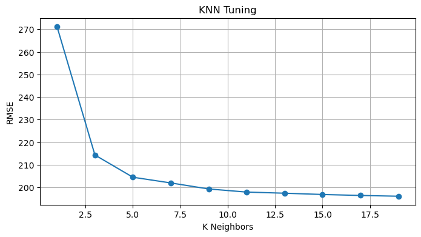
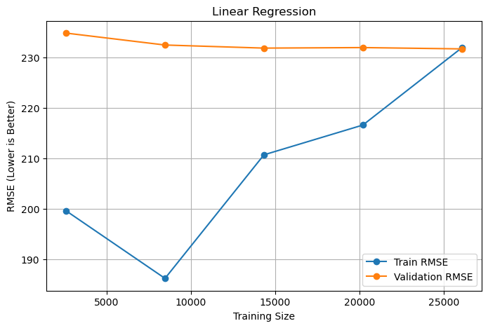
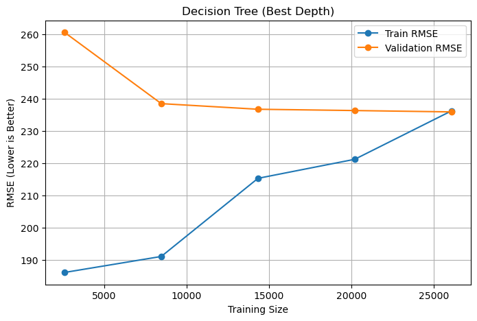

# NYC Airbnb Price Prediction — Regression Benchmark

[](https://colab.research.google.com/github/AsserGharib1/NycAirbnbPricePrediction/blob/main/nyc_airbnb_price_regression.ipynb)
[](https://nbviewer.org/github/AsserGharib1/NycAirbnbPricePrediction/blob/main/nyc_airbnb_price_regression.ipynb)

Price modeling for **48,895 NYC Airbnb listings** (AB_NYC_2019, 11 features) comparing tuned non-linear regressors against a linear baseline — with an honest conclusion.

## Results (held-out test set, preserved in the notebook)

| Model | RMSE | R² |
|---|---|---|
| Linear Regression | **195.48** | **0.136** |
| KNN (tuned, k = 19) | 196.12 | 0.131 |
| Decision Tree (tuned depth) | 200.76 | 0.089 |

The interesting finding: after fair tuning (validation sweeps over k = 1…31 and depths 2…20, learning-curve analysis for each model), the three models land within ~3% RMSE of each other and **the linear baseline narrowly wins** — NYC listing price is dominated by noise and unmodeled factors (location micro-effects, seasonality, listing quality), a ceiling all three models hit. The notebook documents this rather than hiding it: knowing when added model complexity buys nothing is part of the job.

## Sample outputs







## Pipeline

Cleaning → imputation → one-hot encoding → scaling (train-fit only) → hyperparameter sweeps → learning curves → test comparison on RMSE / MSE / R².

## Data

`AB_NYC_2019.csv` — *New York City Airbnb Open Data* (Kaggle).

```bash
pip install -r requirements.txt
jupyter notebook nyc_airbnb_price_regression.ipynb
```
